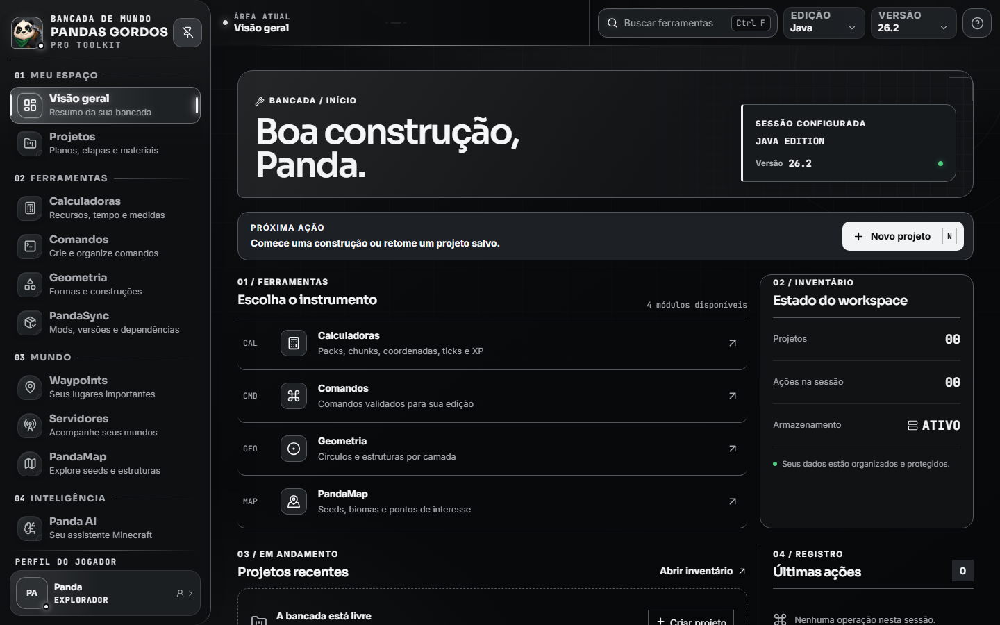
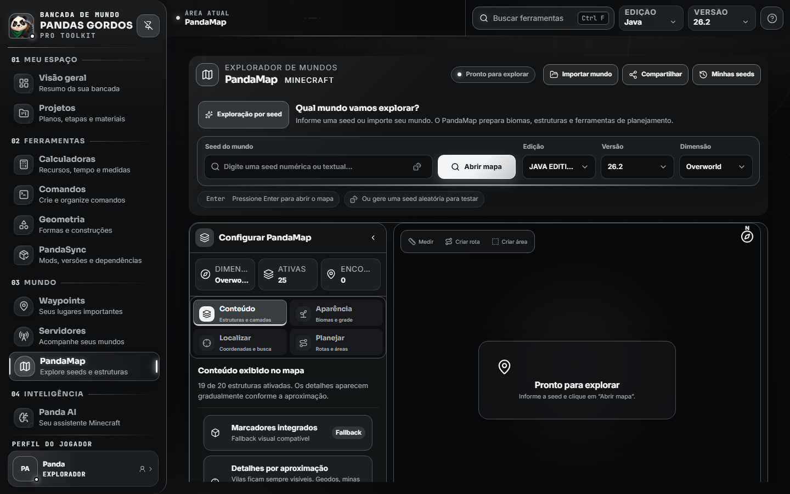
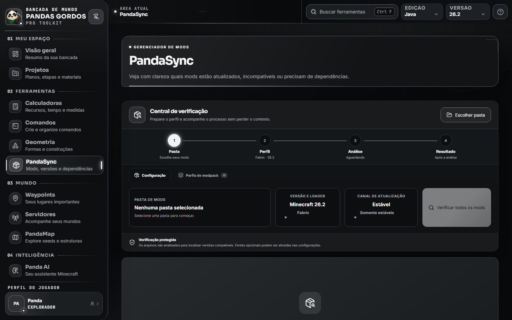
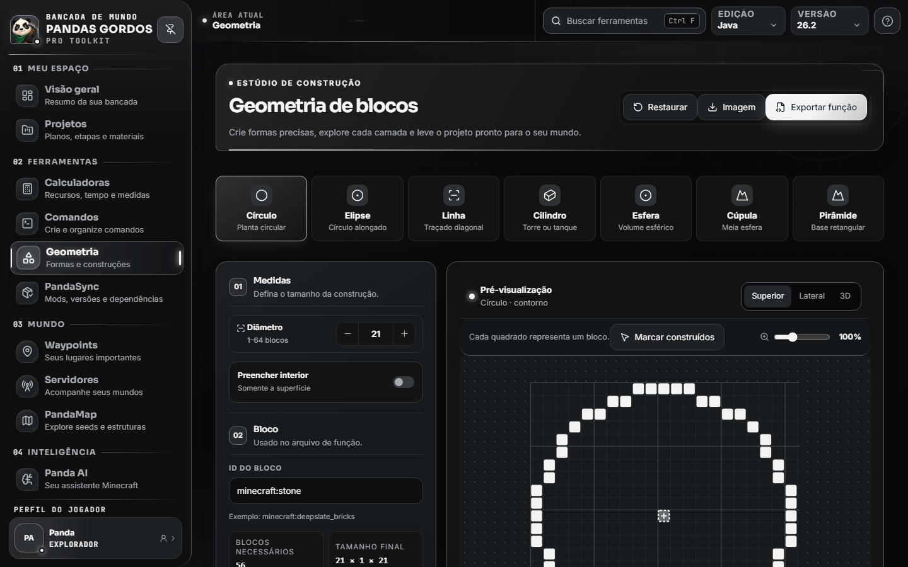

  

  # Pandas Gordos PRO

  **Explore, planeje e organize sua experiência no Minecraft em um único aplicativo.**

  
  
  

  [Baixar a versão mais recente](https://github.com/AlejandroPSilva/Panda-Gordos-Pro-Releases/releases/latest) · [Reportar um problema](https://github.com/AlejandroPSilva/Panda-Gordos-Pro-Releases/issues/new)

---

## Sobre o aplicativo

O **Pandas Gordos PRO** é uma bancada desktop para jogadores, construtores e administradores de Minecraft. O aplicativo reúne exploração de seeds, gerenciamento de mods, cálculos, comandos, geometria, coordenadas, projetos e assistência por IA sem obrigar o usuário a alternar entre várias ferramentas.

O projeto oferece suporte a **Português do Brasil** e **Inglês**, possui temas claro e escuro, interface redimensionável e opções de escala e densidade para diferentes telas.

## Conheça a interface

  
  Tela inicial completa: navegação, busca global, perfil Minecraft, atalhos, projetos e estado da bancada.

 

<table>
  <tr>
    <td width="50%" align="center">
       
      <strong>PandaMap</strong> 
      Seeds, dimensões, estruturas e ferramentas de planejamento.
    </td>
    <td width="50%" align="center">
       
      <strong>PandaSync</strong> 
      Análise de mods, loaders, dependências e atualizações.
    </td>
  </tr>
  <tr>
    <td width="50%" align="center">
       
      <strong>Panda AI</strong> 
      Assistência contextual com configuração guiada e privacidade.
    </td>
    <td width="50%" align="center">
       
      <strong>Geometria</strong> 
      Formas precisas, camadas, visualização de blocos e exportação.
    </td>
  </tr>
</table>

## Recursos

### Visão geral

A página inicial funciona como uma bancada central. Ela reúne atalhos, atividades recentes e acesso rápido a todas as ferramentas. A busca global permite localizar uma função pelo nome, e a barra lateral pode permanecer fixa ou aparecer como sobreposição.

### PandaMap

O explorador de mundos permite:

- Abrir seeds numéricas ou textuais.
- Alternar entre **Java Edition** e **Bedrock Edition**.
- Navegar pelo **Overworld**, **Nether** e **The End**.
- Arrastar o mapa, aplicar zoom e ir diretamente para uma coordenada.
- Visualizar terreno, biomas, chunks, slime chunks e estruturas compatíveis.
- Filtrar estruturas e ajustar a visibilidade de marcadores conforme o zoom.
- Clicar em estruturas para consultar e copiar coordenadas ou um comando `/tp`.
- Criar waypoints, medições, rotas e áreas de planejamento.
- Salvar seeds, importar dados de um mundo e compartilhar a configuração do mapa.
- Ajustar qualidade, consumo de memória e cache de tiles.

A geração Java utiliza recursos do **Cubiomes**. No Bedrock e em versões experimentais, algumas posições são previsões e podem não reproduzir todos os detalhes do jogo. A precisão sempre depende da edição, versão, dimensão e estrutura escolhidas.

### PandaSync

O gerenciador de mods analisa uma pasta sem executar os arquivos JAR. Ele oferece:

- Leitura de nome, ID, versão e loader dos mods.
- Compatibilidade com **Fabric**, **Forge**, **NeoForge** e **Quilt**.
- Consulta de atualizações no **Modrinth** e, opcionalmente, no **CurseForge**.
- Classificação de mods atualizados, compatíveis, incompatíveis, desconhecidos ou com downgrade sugerido.
- Detecção de dependências obrigatórias ausentes e conflitos de loader.
- Instalação de correspondências compatíveis encontradas nas plataformas.
- Associação manual de um arquivo a Modrinth, CurseForge, GitHub ou projeto privado.
- Atualização individual ou em lote com validação, backup e restauração.
- Monitoramento de mudanças na pasta e cache dos últimos resultados.
- Filtros, ordenação e lista virtualizada para pastas grandes.
- Perfis de modpack e exportação de manifesto ou relatório.

Antes de substituir arquivos, o PandaSync verifica condições de segurança e mantém uma cópia recuperável dentro do limite configurado pelo usuário. Mods desconhecidos ou ambíguos devem ser revisados manualmente.

### Panda AI

O assistente usa uma chave **NVIDIA NIM** fornecida pelo próprio usuário. Entre os recursos estão:

- Respostas transmitidas progressivamente no chat.
- Modos especializados para construção, exploração, comandos, redstone, sobrevivência e mods.
- Nível de detalhe configurável.
- Histórico de conversas, conversas privadas e acompanhamento de tokens.
- Leitura de imagens, logs, crash reports, JSON, TOML e manifestos compatíveis.
- Remoção de informações sensíveis dos anexos antes do envio.
- Contexto opcional do PandaMap, PandaSync, Geometria, Comandos e Projetos.
- Sugestões de ações com prévia e confirmação antes de alterar dados do aplicativo.
- Seleção alternativa de modelo quando o modelo escolhido estiver indisponível.
- Renderização segura de Markdown, cancelamento de resposta e nova tentativa em falhas temporárias.

O Panda AI não executa programas, comandos do sistema nem alterações importantes silenciosamente. O conteúdo enviado à NVIDIA depende da mensagem, dos anexos e dos contextos autorizados pelo usuário.

### Calculadoras

As calculadoras são divididas em áreas essenciais, de construção e técnicas:

- Itens, stacks de 64 e sobras.
- Conversão de coordenadas entre Overworld e Nether.
- Bloco para chunk.
- Ticks e segundos.
- Experiência e níveis.
- Lajes, áreas e custo de materiais.
- Catálogo de receitas com ingredientes e ícones disponíveis na instalação do Minecraft.
- Produção de farms, armazenamento e limites de spawn.

Resultados importantes podem ser registrados para consulta posterior ou enviados a uma integração autorizada.

### Comandos

O gerador auxilia na criação de comandos para Java e Bedrock. Os campos guiados reduzem erros de sintaxe, mostram uma prévia e permitem copiar ou salvar o resultado. A edição e a versão selecionadas no topo do aplicativo são consideradas pelas ferramentas compatíveis.

### Geometria

A bancada de geometria transforma medidas em modelos bloco a bloco:

- Círculos, esferas, cúpulas, cilindros, cones e pirâmides.
- Visualização por camada, vista superior/lateral e modelo voxel 3D.
- Câmera livre no modo 3D.
- Contagem de blocos e apoio ao planejamento da construção.
- Exportação de imagem preservando a visualização e a posição atual da câmera.

### Waypoints

Permite salvar bases, farms, portais, estruturas e outros locais por dimensão. Cada waypoint pode receber nome, categoria, coordenadas e observações, além de fornecer um comando de teleporte para cópia.

### Projetos

Organiza construções e objetivos em um só lugar:

- Descrição e progresso do projeto.
- Etapas e tarefas.
- Lista de materiais e quantidades.
- Comandos e coordenadas relacionados.
- Duplicação de um projeto para reutilizá-lo como modelo.

### Servidores

A área de servidores acompanha endereços Java e Bedrock cadastrados, exibindo quando disponível:

- Estado do servidor.
- Versão.
- Jogadores.
- Latência.

A inicialização de servidores locais está marcada como **Em breve** e não faz parte da versão atual.

### Perfil, ajuda e informações

- Perfil com nome e imagem do jogador.
- Guia interno explicando cada bancada, etapas de uso e exemplos.
- Página Sobre com autoria, princípios do projeto e acesso ao relato de bugs.
- Entrada animada e experiência inicial para configurar o perfil.

### Configurações

As configurações centralizam:

- Tema claro ou escuro, escala do texto e densidade da interface.
- Idioma em Português do Brasil ou Inglês.
- Página inicial e opção de continuar da última área visitada.
- Estado das integrações: Discord Presence, NVIDIA NIM, CurseForge, webhook e atualizador.
- Ativação ou desativação do Discord Presence.
- Preferências de privacidade do Panda AI.
- Credenciais salvas, sem reexibir seus valores.
- Limite e manutenção dos backups do PandaSync.
- Diagnóstico simplificado de memória e cache do PandaMap.
- Exportação e restauração de backup das preferências e dados compatíveis.
- Limpeza seletiva ou completa dos dados do aplicativo.

### Atualizações e Discord

- O atualizador consulta novas versões publicadas, mostra uma notificação e instala pacotes assinados pelo sistema de atualização do Tauri após autorização.
- O Discord Presence pode mostrar que o Pandas Gordos PRO está aberto e oferecer acesso à página pública de versões.
- Webhooks são opcionais e somente recebem resultados quando o usuário solicita o envio.

## Privacidade e segurança

- Chaves de API e webhooks são protegidos pelo mecanismo seguro de credenciais do sistema operacional.
- Valores salvos não são exibidos novamente pela interface nem incluídos nos backups comuns.
- O PandaSync lê metadados e impressões digitais dos JARs; ele não executa os mods durante a análise.
- O Markdown da IA é sanitizado antes de ser exibido.
- O aplicativo utiliza uma política de segurança de conteúdo e permissões Tauri limitadas às funções necessárias.
- Logs técnicos são higienizados para evitar o registro de credenciais.
- O usuário pode remover integrações, caches, conversas e demais dados pelas Configurações.

Nenhum software desktop é imune a alterações locais ou engenharia reversa. Não coloque segredos no código-fonte e baixe instaladores somente da página oficial de releases.

## Instalação

### Versão pronta para uso

1. Acesse a [página de releases](https://github.com/AlejandroPSilva/Panda-Gordos-Pro-Releases/releases/latest).
2. Baixe o instalador **MSI** da versão mais recente.
3. Conclua a instalação e abra o Pandas Gordos PRO.

O aplicativo é desenvolvido atualmente para **Windows 10/11 de 64 bits**. Como o instalador ainda pode não possuir assinatura Authenticode, o Windows pode exibir um aviso de reputação mesmo quando a assinatura do atualizador e o hash do arquivo são válidos.

## Especificações técnicas

O código-fonte é mantido em um repositório privado. Este repositório público contém a apresentação do produto, o feed de atualização e os arquivos oficiais de distribuição.

### Arquitetura

O Pandas Gordos PRO usa uma arquitetura desktop híbrida. A interface React é executada pelo WebView2 e se comunica com o núcleo Rust por comandos Tauri explicitamente registrados. Operações de arquivos, credenciais, rede, atualizações e processamento nativo permanecem no backend; componentes visuais, navegação e estado da sessão ficam na interface.

| Área | Implementação | Responsabilidade |
| --- | --- | --- |
| Aplicativo desktop | **Tauri 2** | Janela nativa, empacotamento, permissões e comunicação segura entre interface e sistema |
| Núcleo | **Rust 2021** + Tokio | Arquivos, rede assíncrona, credenciais, diagnósticos, atualizações e operações do PandaSync |
| Interface | **React 19** + **TypeScript 5.8** | Páginas, componentes, acessibilidade e experiência interativa |
| Estado | **Zustand 5** | Preferências, edição, versão, projetos, waypoints e navegação compartilhada |
| Build | **Vite 7** | Desenvolvimento, divisão de código, otimização e bundle de produção |
| Estilos | **Tailwind CSS 4** + CSS modular por área | Temas, densidade, escala, responsividade e identidade visual |
| Renderização | **Canvas 2D**, **Web Workers** e **Three.js** | Tiles do PandaMap, processamento fora da thread principal e geometria 3D |
| Listas extensas | **TanStack Virtual** | Renderização eficiente de grandes pastas de mods |
| Idiomas | **i18next** + **react-i18next** | Catálogos e alternância imediata entre pt-BR e en-US |
| Conteúdo da IA | **React Markdown**, GFM e sanitização | Exibição controlada de Markdown retornado pelos modelos |
| Geração Java | **Cubiomes**, integrado em C/Rust | Biomas e estruturas compatíveis do PandaMap Java |

### Linguagens utilizadas

| Linguagem | Uso no projeto |
| --- | --- |
| **Rust** | Backend Tauri, segurança, integrações, arquivos, cache e PandaSync |
| **TypeScript / TSX** | Regras da interface, páginas React, componentes e serviços do frontend |
| **CSS** | Sistema visual, temas, animações, densidade e layouts responsivos |
| **C** | Ponte nativa e integração do Cubiomes para geração do PandaMap Java |
| **JavaScript / MJS** | Scripts de build, tradução, auditoria, SBOM, versões e release |
| **PowerShell** | Automação de releases e preparação dos instaladores Windows |
| **JSON / TOML** | Configuração do Tauri, Cargo, traduções, permissões e manifestos |

### Integrações e serviços

| Integração | Finalidade |
| --- | --- |
| **NVIDIA NIM** | Catálogo de modelos e respostas do Panda AI com a chave do usuário |
| **Modrinth** | Identificação de projetos, versões e dependências de mods |
| **CurseForge** | Pesquisa complementar opcional mediante chave configurada pelo usuário |
| **Discord Rich Presence** | Exibição opcional da atividade do aplicativo no Discord |
| **Discord Webhooks** | Registro opcional e autorizado de resultados selecionados |
| **Tauri Updater** | Consulta, validação, download e instalação de novas versões |
| **Minecraft Launcher** | Leitura opcional de recursos instalados para receitas e ícones disponíveis |

### Segurança e distribuição

| Item | Implementação atual |
| --- | --- |
| Credenciais | Armazenamento protegido pelo mecanismo de credenciais do sistema operacional |
| Superfície Tauri | Comandos registrados e capacidades limitadas às funções necessárias |
| Conteúdo web | Política CSP, ausência de frames externos e Markdown sanitizado |
| Rede | Requisições realizadas no backend Rust com TLS via Rustls |
| Atualizações | Artefatos assinados pelo atualizador Tauri e publicados por HTTPS |
| Instalador principal | MSI para Windows 10/11 x64 |
| Integridade | Geração de hashes SHA-256 e SBOM no fluxo de release |
| Build de produção | Minificação, sourcemaps desativados e símbolos Rust removidos |

### Requisitos de execução

| Requisito | Especificação |
| --- | --- |
| Sistema operacional | Windows 10 ou Windows 11 de 64 bits |
| Motor da interface | Microsoft Edge WebView2 Runtime |
| Conexão | Opcional para funções internas; necessária para IA, mods, servidores e atualizações |
| Conta externa | Não é obrigatória para utilizar as ferramentas principais |
| Chave NVIDIA | Necessária somente para ativar o Panda AI |
| Chave CurseForge | Opcional; o PandaSync continua utilizando o Modrinth sem ela |

## Limitações conhecidas

- Resultados do PandaMap podem variar em versões experimentais e no Bedrock.
- Nem todo mod desconhecido pode ser associado automaticamente a uma plataforma.
- Recursos online dependem da conexão e da disponibilidade dos respectivos serviços.
- O Panda AI exige uma chave NVIDIA NIM válida do usuário.
- Inicialização e administração de servidores locais ainda não estão disponíveis.

## Criador

<table>
  <tr>
    <td width="116" align="center">
      
    </td>
    <td>
      <strong>AlejandroPSilva</strong> 
      Criador e desenvolvedor do Pandas Gordos PRO. 
      <a href="https://github.com/AlejandroPSilva">github.com/AlejandroPSilva</a>
    </td>
  </tr>
</table>

## Aviso legal

Pandas Gordos PRO é um projeto independente e não é afiliado, aprovado ou patrocinado pela Mojang Studios, Microsoft, NVIDIA, Modrinth, CurseForge ou Discord. Minecraft e as demais marcas pertencem aos seus respectivos proprietários.
